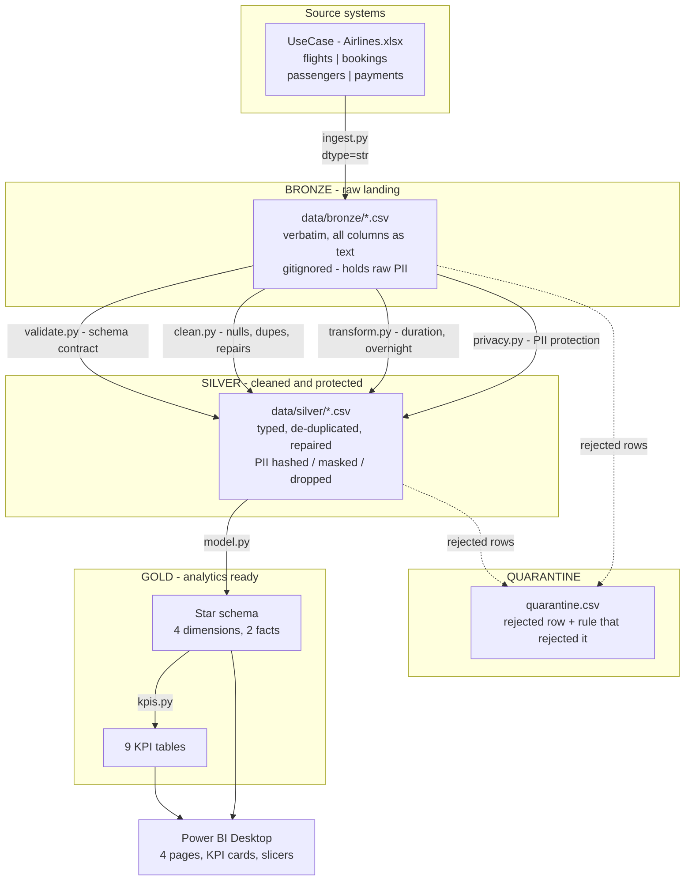
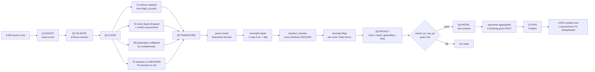
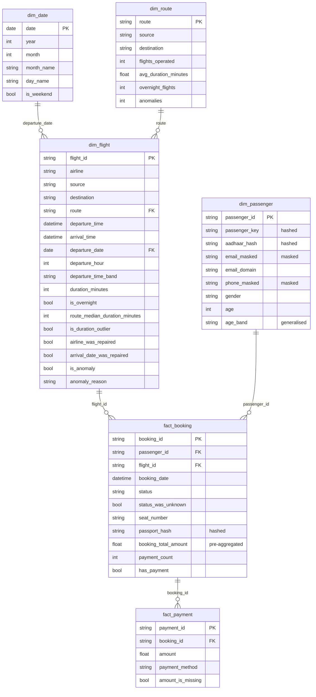

# Architecture, Data Flow and Data Model

Diagrams render natively on GitHub.

---

## 1. Architecture diagram

**Orchestration:** `pipeline.py` is the single entry point (`python -m src.pipeline`).
It owns stage order and the reconciliation report; it contains no business logic.

---

## 2. Data flow diagram

---

## 3. Data model

### Grains

| Table | Grain | Rows |
|---|---|---|
| `dim_flight` | one flight | 1,004 |
| `dim_passenger` | one passenger | 1,000 |
| `dim_route` | one source-destination pair | 30 |
| `dim_date` | one calendar date | 345 |
| `fact_booking` | one booking | 1,000 |
| `fact_payment` | one payment | 1,000 |

**Critical modelling rule:** `fact_booking` and `fact_payment` are never joined to
each other. 1,000 payments belong to only 637 bookings, so a direct join is
one-to-many and would inflate every count and revenue figure. Booking-level revenue
comes from the pre-aggregated `fact_booking[booking_total_amount]`. See
`DECISIONS.md` D-016.
